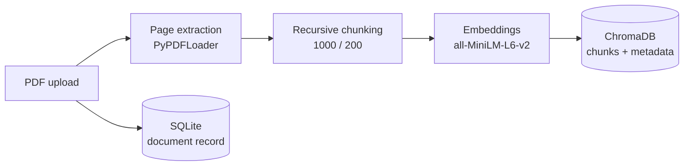
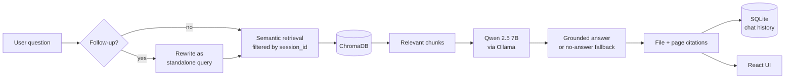
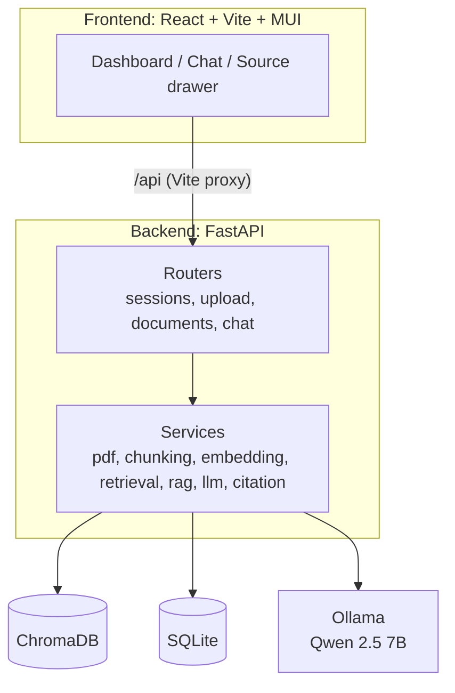
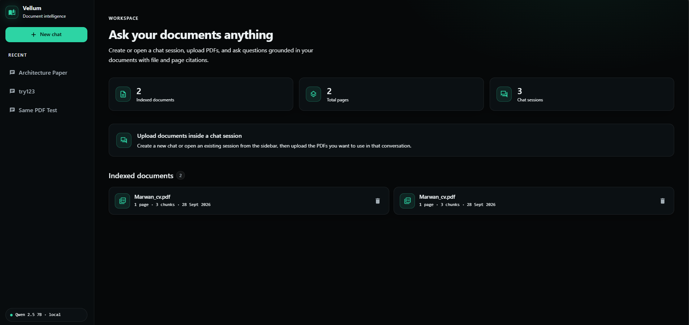
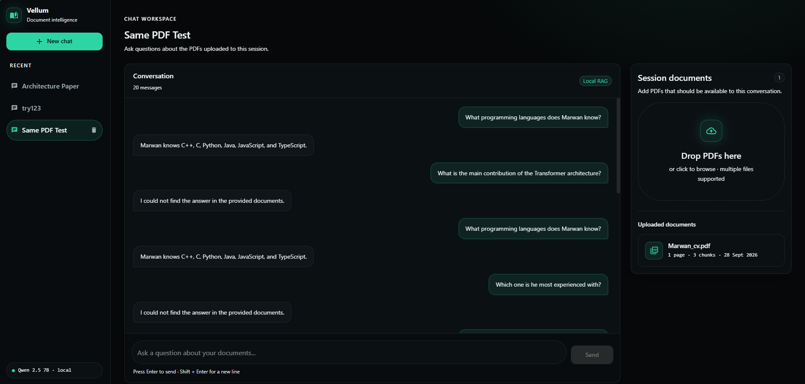
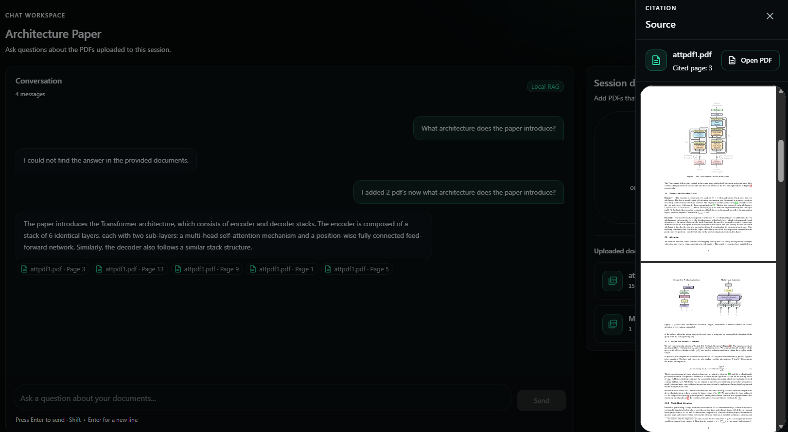

<div align="center">

# Multi-PDF RAG Assistant

**Chat with your PDFs. Fully local. Every answer cites its file and page.**

A document-grounded AI workspace built on FastAPI, ChromaDB and a local Qwen 2.5 7B model.
No cloud LLM, no API keys, no data leaving your machine.


</div>

<!-- Replace with your best screenshot or a short GIF of ask → answer → click citation -->


---

## Overview

Multi-PDF RAG Assistant lets you create isolated chat sessions, upload multiple PDFs into each one, and ask questions about their contents. Answers are generated **only from the retrieved document context**, and every answer links back to the exact **file and page** it came from. Clicking a citation opens the cited PDF page inside the app.

The system is a complete retrieval-augmented generation pipeline: PDF ingestion, chunking, local embeddings, session-filtered vector search, conversational query rewriting, local LLM generation, persistent chat history, and a React workspace on top.

### Highlights

- **Grounded answers with citations.** Page-level sources are stored with each message and shown as clickable chips.
- **Session isolation.** Retrieval is filtered by `session_id`, so one conversation can never leak documents into another, even when the same PDF exists in both.
- **Honest failure mode.** When the documents don't support an answer, the assistant says so instead of guessing.
- **Conversation-aware retrieval.** Follow-up questions such as *"Which one is listed first?"* are rewritten into standalone queries before search.
- **100% local.** Embeddings run through SentenceTransformers and generation through Ollama.
- **Persistent.** Sessions, documents and chat history survive restarts (SQLite and ChromaDB).

---

## Features

| Area | What it does |
|---|---|
| **Documents** | Multi-PDF upload, page-by-page extraction, duplicate PDF detection within a session, document deletion |
| **Sessions** | Independent chat sessions, automatic session naming, rename, delete |
| **Retrieval** | Recursive chunking, local embeddings, persistent vector storage, session-filtered semantic search |
| **Generation** | Local Qwen 2.5 7B via Ollama, context-only answering, no-answer fallback |
| **Conversation** | Multi-turn history, follow-up query rewriting, persistent messages |
| **Citations** | File + page sources, clickable citation chips, source drawer with in-app PDF preview, open page in a new tab |
| **Interface** | Dark, responsive document workspace built with React and Material UI |

---

## Architecture

### Ingestion



### Question answering



### System overview



---

## How the RAG pipeline works

### 1. PDF ingestion
PDFs are loaded page by page with `PyPDFLoader`. Page numbers are kept as metadata so every retrieved chunk can be traced back to its source page.

### 2. Chunking
Text is split with `RecursiveCharacterTextSplitter`:

| Parameter | Value |
|---|---|
| Chunk size | 1000 |
| Chunk overlap | 200 |

### 3. Embeddings
Chunks are embedded locally with `sentence-transformers/all-MiniLM-L6-v2`. No external embedding API is used.

### 4. Vector storage and retrieval
ChromaDB stores each chunk with its metadata:

- source filename
- page number
- document ID
- document UID
- session ID

A similarity search returns the chunks most relevant to the question.

### 5. Session isolation
Every chunk carries a `session_id`, and retrieval always filters on the active session. The same PDF can be uploaded into several sessions without their results mixing:

```text
Session 5                         Session 6
├── Marwan_cv.pdf                 └── (no documents)
└── attpdf1.pdf

A question asked in Session 6 can never retrieve content from Session 5.
```

### 6. Query rewriting
Follow-up questions often depend on earlier turns:

```text
User: What programming languages does Marwan know?
User: Which one is listed first?
```

The second question is meaningless to a vector search on its own. The system uses the conversation history to rewrite it into a standalone retrieval query. The rewritten query is used **only for retrieval**. The final answer must still be supported by the retrieved context.

### 7. Local generation
The retrieved context is passed to Qwen 2.5 7B running through Ollama. The model is instructed to answer only from that context. When the documents don't support an answer, the system returns:

> I could not find the answer in the provided documents.

### 8. Citations
Sources are returned with the answer and persisted with the message:

```json
{ "file": "attpdf1.pdf", "page": 3 }
```

The frontend renders them as chips such as `📄 attpdf1.pdf · Page 3`. Clicking one opens a source drawer with the filename, the cited page, and an embedded PDF preview, plus an option to open the page in a new browser tab.

---

## Tech stack

**Backend**

| Technology | Purpose |
|---|---|
| Python | Backend language |
| FastAPI | REST API |
| LangChain | Document and RAG orchestration |
| PyPDFLoader | PDF extraction |
| RecursiveCharacterTextSplitter | Chunking |
| SentenceTransformers | Local embeddings |
| ChromaDB | Persistent vector database |
| Ollama + Qwen 2.5 7B | Local LLM runtime and model |
| SQLite + SQLAlchemy | Sessions, documents and chat persistence |

**Frontend**

| Technology | Purpose |
|---|---|
| React + Vite | UI framework and tooling |
| Material UI | Components and theming |
| React Router | Client-side routing |

---

## Getting started

### Prerequisites

- Python 3.10+ (adjust to the version you developed with)
- Node.js and npm
- [Ollama](https://ollama.com)

Pull the model:

```bash
ollama pull qwen2.5:7b
```

Make sure Ollama is running before you start the backend.

### 1. Backend

From the project root:

<details open>
<summary><b>Windows (PowerShell)</b></summary>

```powershell
python -m venv venv
.\venv\Scripts\Activate.ps1
python -m pip install -r requirements.txt
python -m uvicorn backend.main:app --reload
```
</details>

<details>
<summary><b>macOS / Linux</b></summary>

```bash
python3 -m venv venv
source venv/bin/activate
python -m pip install -r requirements.txt
python -m uvicorn backend.main:app --reload
```
</details>

| URL | What |
|---|---|
| http://127.0.0.1:8000 | API |
| http://127.0.0.1:8000/docs | Swagger UI |

> The first run downloads the embedding model, so startup takes longer once.

### 2. Frontend

In a second terminal:

```bash
cd frontend
npm install
npm run dev
```

Open http://localhost:5173. The Vite dev server proxies `/api` requests to the FastAPI backend.

---

## Usage

1. Open the dashboard.
2. Create a new chat session.
3. Upload one or more PDFs. They are extracted, chunked, embedded and indexed.
4. Ask a question.
5. Read the grounded answer and its citation chips.
6. Click a citation to inspect the exact page in the source drawer.

---

## API reference

| Method | Endpoint | Description |
|---|---|---|
| `GET` | `/health` | Health check |
| `POST` | `/sessions?name=New%20Chat` | Create a session |
| `GET` | `/sessions` | List sessions |
| `PATCH` | `/sessions/{session_id}` | Rename a session |
| `DELETE` | `/sessions/{session_id}` | Delete a session |
| `POST` | `/upload?session_id={id}` | Upload a PDF (multipart field `file`) |
| `GET` | `/documents` | List documents |
| `GET` | `/documents/{document_id}/file?session_id={id}` | Serve the PDF for source preview |
| `DELETE` | `/documents/{document_id}` | Delete a document |
| `POST` | `/chat` | Ask a question |
| `GET` | `/chat/{session_id}/messages` | Get conversation history |

<details>
<summary><b>Example: rename a session</b></summary>

```json
PATCH /sessions/5
{ "name": "Transformer Architecture" }
```
</details>

<details>
<summary><b>Example: ask a question</b></summary>

Request:

```json
{
  "question": "What architecture does the paper introduce?",
  "session_id": 5
}
```

Response:

```json
{
  "answer": "The paper introduces the Transformer architecture...",
  "sources": [
    { "file": "attpdf1.pdf", "page": 3 }
  ],
  "session_id": 5,
  "user_message_id": 10,
  "assistant_message_id": 11
}
```
</details>

---

## Project structure

```text
multi-pdf-rag-assistant/
├── app/
│   └── rag.py
├── backend/
│   ├── main.py
│   ├── config.py
│   ├── database.py
│   ├── models/          # chat, document, session
│   ├── routers/         # chat, documents, sessions, upload
│   ├── services/
│   │   ├── pdf_service.py
│   │   ├── chunking_service.py
│   │   ├── embedding_service.py
│   │   ├── vectordb_service.py
│   │   ├── retrieval_service.py
│   │   ├── llm_service.py
│   │   ├── rag_service.py
│   │   └── citation_service.py
│   └── utils/
├── frontend/
│   ├── public/
│   └── src/
│       ├── components/  # sidebar, uploader, chat, citation chip, source drawer
│       ├── layouts/
│       ├── pages/       # Dashboard, Chat
│       ├── services/    # API client
│       ├── theme/
│       └── utils/
├── tests/
├── requirements.txt
├── LICENSE
└── .gitignore
```

Runtime data is created locally and excluded from version control:

```text
data/
├── uploads/     # original PDFs
├── chroma/      # vector store
└── metadata/
```

---

## Design decisions

| Decision | Reasoning |
|---|---|
| **ChromaDB** | Persistent local vector storage with simple metadata filtering. No hosted vector DB needed. |
| **SentenceTransformers** | A lightweight local embedding model, so semantic search needs no external API. |
| **Ollama + Qwen 2.5 7B** | Inference stays on the developer machine and doesn't depend on a cloud LLM. |
| **Metadata-filtered retrieval** | Putting `session_id` on every chunk makes isolation a property of the data, not of UI logic. |
| **Rewrite for retrieval only** | Rewritten queries improve search, while the answer is still constrained by retrieved context. |
| **SQLite** | Enough for sessions, documents and chat history, and keeps local setup simple. |
| **Layered backend** | Routers handle HTTP and services handle each pipeline stage, so each stage is testable on its own. |

---

## Testing

The `tests/` directory covers each stage of the pipeline:

| Area | Test file |
|---|---|
| PDF processing | `test_pdf.py` |
| Chunking | `test_chunking.py` |
| Embeddings | `test_embedding.py` |
| Vector database | `test_vectordb.py` |
| Session / vector relationships | `test_session_vectors.py` |
| Retrieval | `test_retrieval.py` |
| Citations | `test_citations.py` |
| LLM integration | `test_llm.py` |
| End-to-end RAG | `test_rag.py` |

```bash
python -m pytest tests
```

> Some tests (`test_llm.py`, `test_rag.py`) need Ollama running with `qwen2.5:7b` available.

---

## Limitations

- Local 7B inference can be slow depending on your hardware.
- Responses are not streamed. The full answer appears when generation finishes.
- PDF previews rely on the browser's native PDF viewer.
- There is no authentication or multi-user account system.
- It hasn't been deployed as a hosted production service.
- Retrieval quality depends on the embedding model, chunking strategy and the context that gets retrieved.

## Roadmap

- [ ] Streaming responses
- [ ] Improved retrieval (MMR) and optional reranking
- [ ] Retrieval evaluation and benchmarking
- [ ] More advanced chunking strategies
- [ ] Expanded automated tests
- [ ] Docker-based deployment
- [ ] Authentication and multi-user support
- [ ] Richer document preview

These are planned improvements, not completed features.

---

## Screenshots

| Dashboard | Chat |
|---|---|
|  |  |

| Citation preview |
|---|
|  |

---

## What this project demonstrates

- End-to-end retrieval-augmented generation
- Semantic vector search with metadata filtering
- Local LLM inference and local embeddings
- Session-aware, multi-document question answering
- Source attribution with page-level citations
- Conversational query rewriting
- Layered FastAPI backend design with persistence
- A modular React and Material UI frontend

---

## License

Released under the [MIT License](LICENSE).
